# 💿 Vinyl Intelligence

**Your record collection, understood.**

Vinyl Intelligence turns a personal vinyl collection into a searchable, visual, organized, and conversational music library. It exists to answer one question a spreadsheet or a shelf never can:

> **"What from the records I actually own should I listen to right now — and why?"**

It is not a generic music recommender, and it is not a chatbot with album data bolted on. Every recommendation, every filter, and every piece of metadata is grounded in a collection the user actually owns.

<p align="center">
  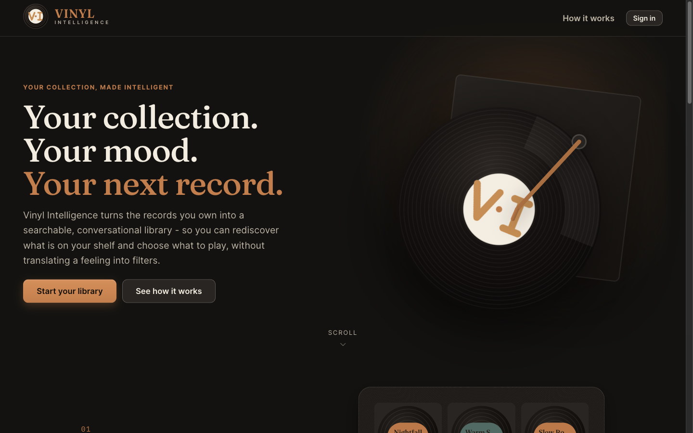
</p>

<p align="center">
  <a href="https://vinyl-intelligence.netlify.app"><b>🚀 Live Application</b></a> ·
  <a href="docs/USER_GUIDE.md"><b>📖 User Guide</b></a> ·
  <a href="docs/INSPECT.md"><b>🔎 Visual Inspect</b></a> ·
  <a href="SPEC.md"><b>📋 Specification</b></a> ·
  <a href="docs/architecture.md"><b>🏗 Architecture</b></a>
</p>

---

## Table of Contents

- [🎯 What Is Vinyl Intelligence?](#-what-is-vinyl-intelligence)
- [💡 The Problem](#-the-problem)
- [✨ Key Features](#-key-features)
- [🤖 Meet VIN — AI Curator](#-meet-vin--ai-curator)
- [📀 Personal Collection](#-personal-collection)
- [🔎 Discover Records](#-discover-records)
- [📸 Scan a Record Cover](#-scan-a-record-cover)
- [🎧 Listening History](#-listening-history)
- [⭐ Ratings, Favorites, Notes & Personal Genres](#-ratings-favorites-notes--personal-genres)
- [🌍 Hebrew & Multilingual Records](#-hebrew--multilingual-records)
- [🖼️ Screenshots](#-screenshots)
- [🏗️ Architecture](#-architecture)
- [🧰 Tech Stack](#-tech-stack)
- [🚀 Live Application](#-live-application)
- [💻 Local Installation](#-local-installation)
- [▶️ Running Locally](#-running-locally)
- [🧪 Verification](#-verification)
- [📚 Documentation](#-documentation)
- [🔒 Security & Privacy](#-security--privacy)
- [⚠️ Known Limitations](#-known-limitations)
- [📜 Project Status & History](#-project-status--history)
- [🎓 ASE-26 Course Context](#-ase-26-course-context)

---

## 🎯 What Is Vinyl Intelligence?

A web application for vinyl collectors that combines a real personal database with two complementary ways to use it:

- **Classic library mode** — search, filter, sort, and browse the collection like any well-built catalog app.
- **AI curator mode** — describe a mood or situation in plain language and get a small set of grounded suggestions, chosen only from records the user owns.

Both modes read from the same underlying collection, ratings, and listening history, so the AI mode is never guessing at a catalog it can't see.

## 💡 The Problem

Vinyl collectors often remember a mood, a decade, or a feeling before they remember the exact album title. Traditional collection software answers *"what do I own?"* Vinyl Intelligence also answers *"given what I own, what should I play now, and why?"* — without forcing the user to translate a feeling into genre/year filters first.

## ✨ Key Features

| Feature | What it does |
| --- | --- |
| 🤖 AI Curator (VIN) | Natural-language mood → grounded recommendations from owned records only |
| 💬 Conversational refinement | Bounded follow-up turns that narrow a previous recommendation |
| 📀 Personal collection | Full CRUD, organized by artist, genre, year, decade, rating, favorites |
| 🔎 Catalog-assisted add | MusicBrainz search → candidate confirmation → import |
| 📸 AI cover recognition | Photograph a sleeve → vision clues → catalog match → confirm → save |
| 🔁 Duplicate-copy handling | Owning a second physical pressing is disclosed and explicitly confirmed, never blocked or silently duplicated |
| 🔍 Deterministic search/filter/sort | Artist, title, genre, decade, rating, listening recency — no LLM involved |
| 🎧 Listening history | Mark a play, see derived counts and last-listened, correct or delete your own plays |
| ⭐ Ratings, favorites, notes | Personal signals stored per collection item |
| 🏷️ Personal genres | User-owned tags layered on top of shared catalog genres |
| 🖼️ Custom cover art | Optional per-item cover upload, catalog artwork by default |
| 🌍 Hebrew & multilingual records | Correct bidirectional rendering, script-aware search/sort, original-script preservation in vision recognition |
| 🔒 Ownership-first security | RLS on every table, least-privilege grants, server-only secrets |

## 🤖 Meet VIN — AI Curator

<p align="center">
  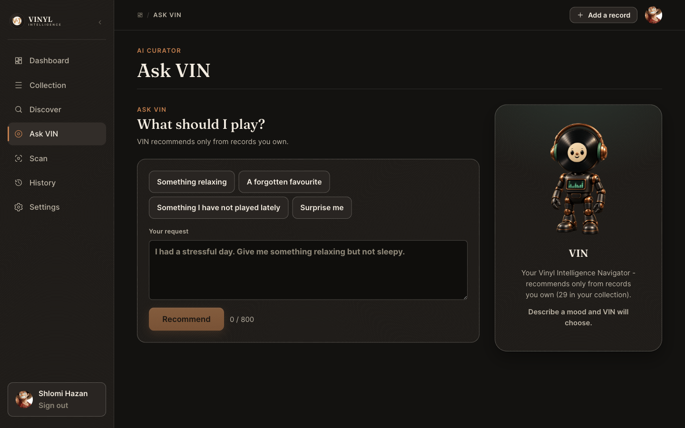
</p>

**VIN (Vinyl Intelligence Navigator)** is the conversational entry point to the collection. Describe a mood — *"I had a stressful day, give me something relaxing but not sleepy"* — or use a preset ("Something relaxing," "A forgotten favorite," "Something I have not played lately," "Surprise me"), and VIN returns a small set of picks with a short, grounded reason for each.

The non-negotiable rule: **VIN recommends only from records the user owns.** The backend builds the candidate set from the user's own RLS-scoped collection and listening history before any model call; the model receives only that bounded, allowed set and never a raw database dump; a returned suggestion whose ID isn't in that allowed set is rejected outright rather than shown. A short bounded follow-up (*"make it more energetic"*) refines the same request without starting over.

## 📀 Personal Collection

<p align="center">
  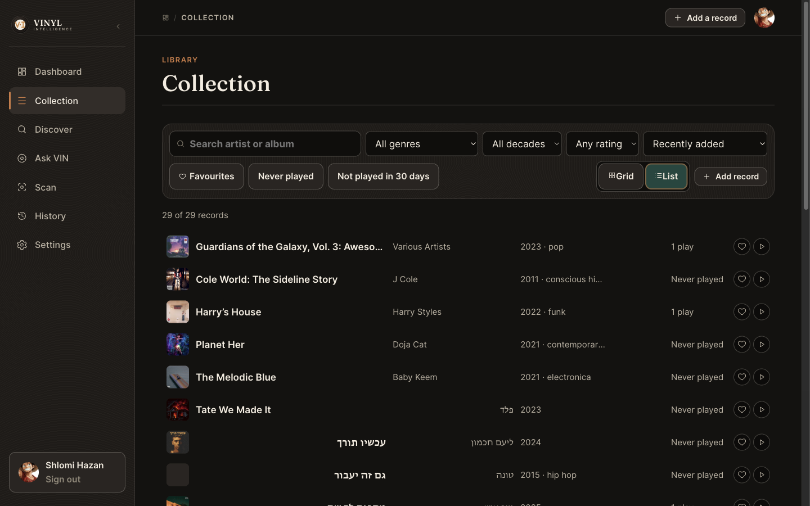
</p>

Every collection item combines shared catalog facts (artist, title, year, label, genres — sourced from MusicBrainz) with data the user fully owns: rating, favorite flag, personal notes, personal genres, custom cover, and listening history. Browse by artist, genre, year/decade, favorites, minimum rating, or listening recency ("Never played," "Not played in 30 days," "Least recently played"), in Grid or List view, on desktop or mobile — all deterministic, with no network round-trip on a filter change.

## 🔎 Discover Records

<p align="center">
  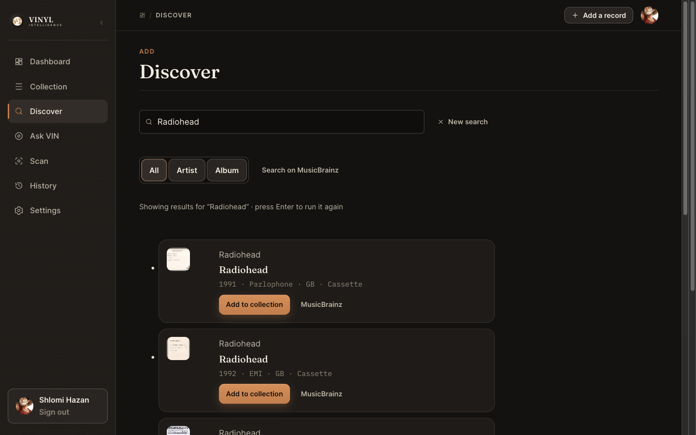
</p>

Search MusicBrainz by artist and album, confirm the correct release, and add it. If a candidate is a release **already** in the collection, Discover says so honestly ("In your collection") and still offers an explicit **"Add another copy"** action for a legitimate second pressing — click it and a single confirmation dialog is the only way an extra physical copy is ever added:

<p align="center">
  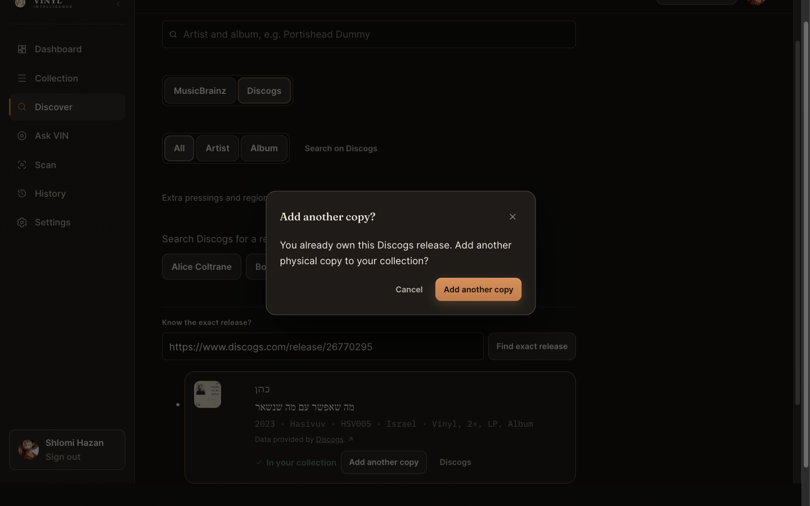
</p>

## 📸 Scan a Record Cover

<p align="center">
  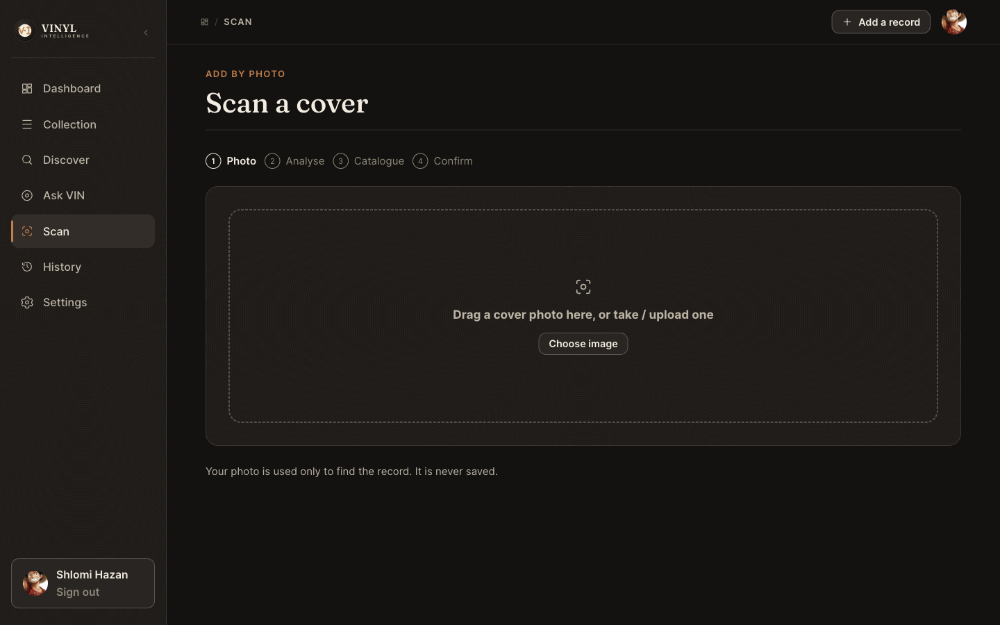
</p>

Photograph or upload a cover. A vision model extracts likely clues (artist, title, label, catalog number); those clues drive a MusicBrainz search; the user picks the matching release; nothing is saved until that explicit confirm. The photo itself is used only to find the record — it is **never stored**.

## 🎧 Listening History

<p align="center">
  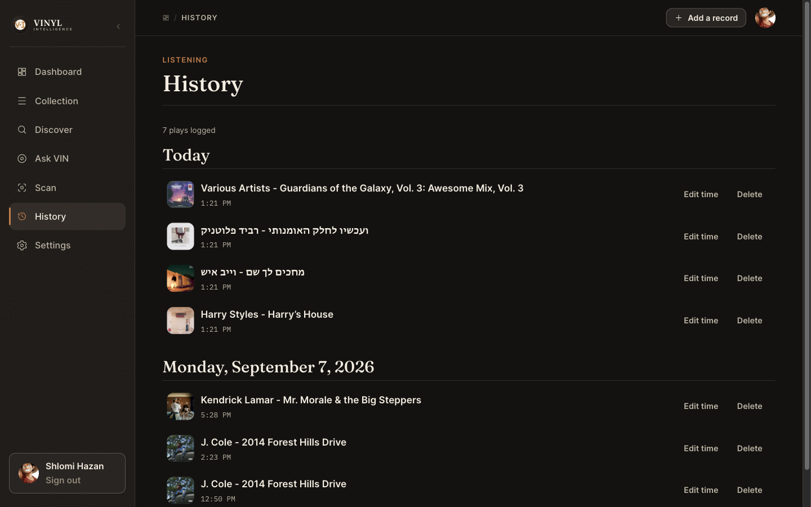
</p>

"Mark played" logs a listen; play count and last-listened date are derived from that history, not stored counters. History is append-only by design, with one narrow, owner-scoped exception: a collector can correct a mistyped time or delete their own accidental log entry — a play can never be re-pointed at a different record or another user's history.

## ⭐ Ratings, Favorites, Notes & Personal Genres

<p align="center">
  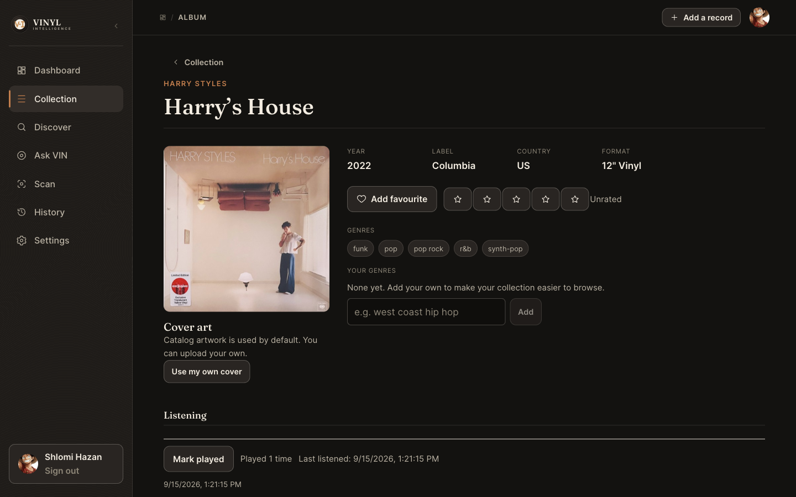
</p>

The Album Detail page is the clearest picture of the app's metadata boundary: catalog genres are shown as read-only chips (shared data, sourced from MusicBrainz), while "Your genres," rating, favorite, notes, and cover art are all editable, owner-scoped overlays layered on top. VIN can use these signals; it never invents or overwrites them.

## 🌍 Hebrew & Multilingual Records

<p align="center">
  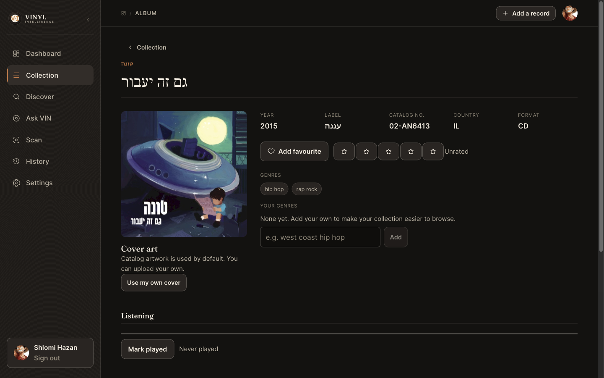
</p>

Dynamic record content — titles, artists, labels, genres — renders correctly regardless of script, with local bidirectional-text isolation, niqqud-insensitive Hebrew search, deterministic mixed-script sorting, a shared Hebrew/English genre-alias taxonomy, and vision recognition that preserves the original sleeve script rather than translating it. The application chrome itself stays English/left-to-right by design — this is not a localization project, just a collection that doesn't break when a record isn't in English.

## 🖼️ Screenshots

| | |
| --- | --- |
| 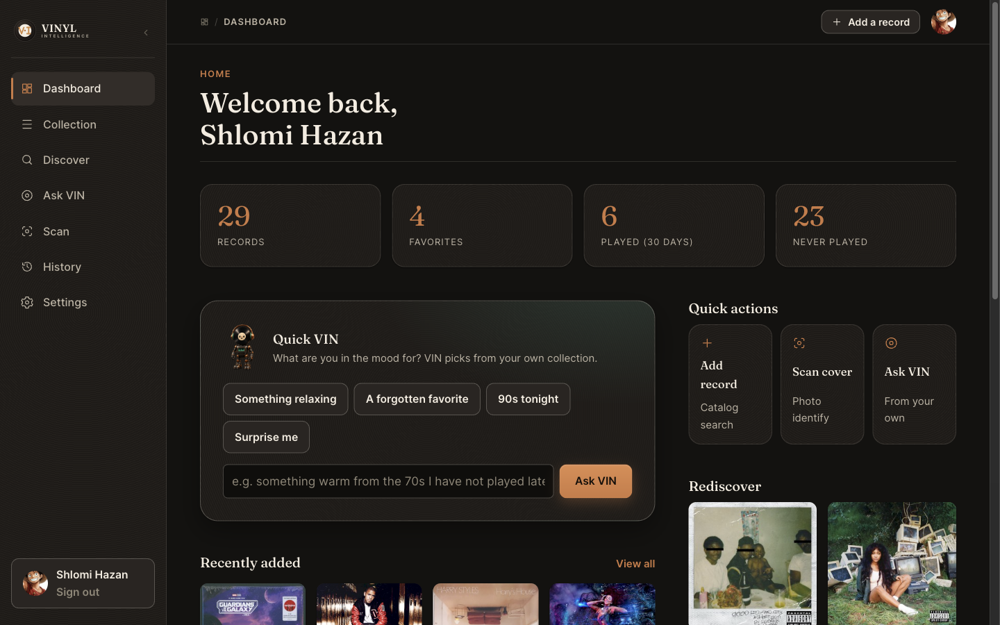 | 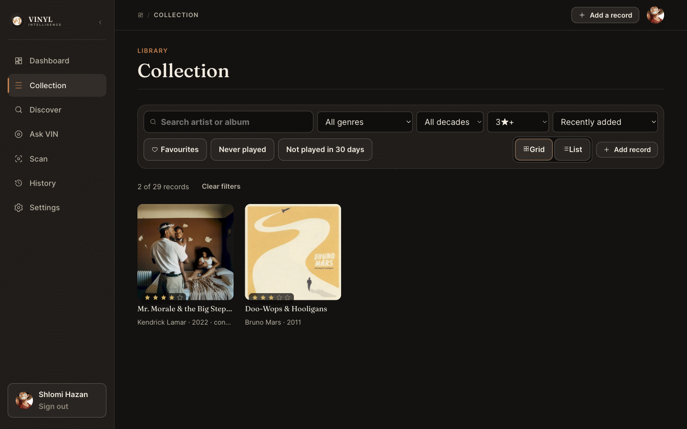 |
| Dashboard — stats, Quick VIN, quick actions | Collection — minimum-rating filter applied |
| 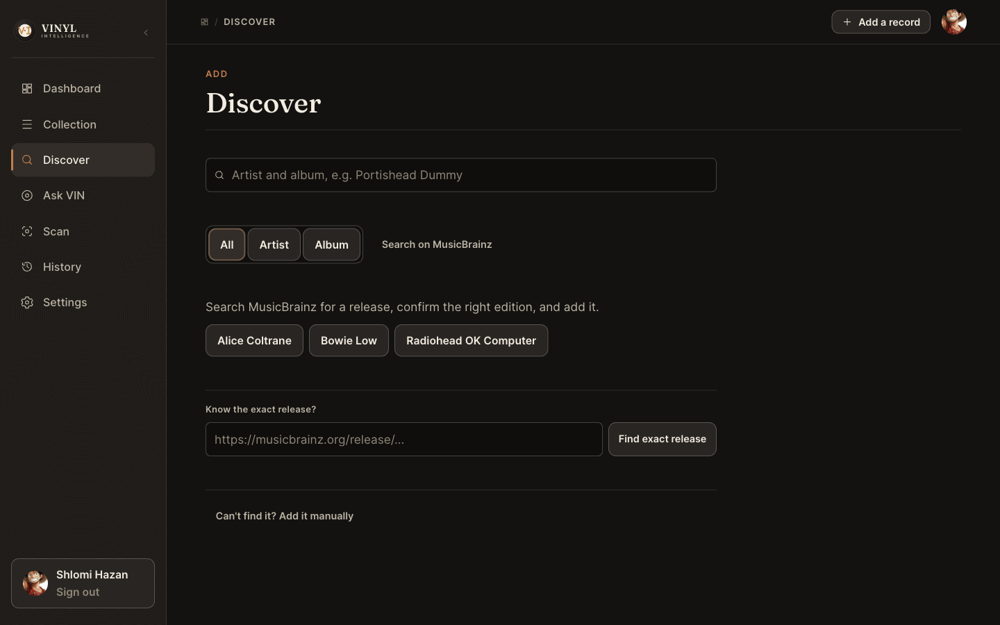 | 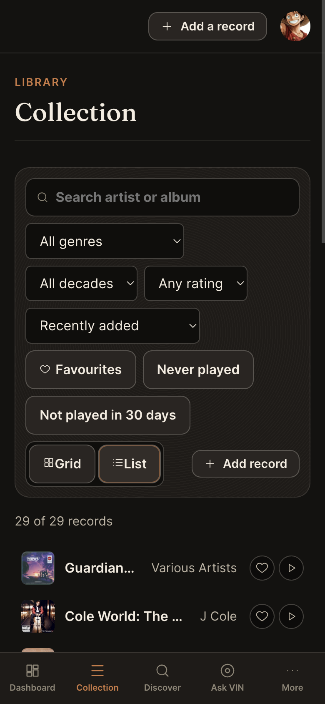 |
| Discover — catalog search entry point | Mobile — Collection on a narrow viewport |

More screens are shown throughout this README and in the [User Guide](docs/USER_GUIDE.md) and [Visual Inspect](docs/INSPECT.md) guide.

## 🏗️ Architecture

```text
Browser (Vite + React 19 + TypeScript SPA on Netlify static hosting)
  | react-router-dom v7, route-level code splitting
  | Supabase JS client, publishable key only — no privileged credential ever reaches it
  |
  |---- direct, RLS / Storage-policy authorized ----> Hosted Supabase
  |       auth · collection CRUD · ratings/favorites/      Postgres + RLS, Auth,
  |       notes · personal genres · listening history ·    Storage (private buckets)
  |       profile · custom cover + avatar upload
  |
  `---- provider access + shared-data writes -------> Netlify Functions (six functions, server secrets only)
          |  /api/health                    liveness
          |  /api/catalog/search    (GET)   MusicBrainz release search
          |  /api/catalog/add       (POST)  upsert shared release + insert owned collection item
          |  /api/catalog/recognize (POST)  OpenRouter vision recognition
          |  /api/curator/recommend (POST)  initial recommendation pipeline
          |  /api/curator/refine    (POST)  bounded refinement pipeline
          v
      Hosted Supabase (service-role,   OpenRouter                MusicBrainz + Cover Art Archive
      shared releases + telemetry       google/gemini-3.1-flash-lite (vision + intent)
      writes only)                      google/gemini-3.5-flash (selection)
```

Full detail, including rejected alternatives and the reasoning behind each decision, lives in [`docs/architecture.md`](docs/architecture.md), [`docs/data-model.md`](docs/data-model.md), [`docs/ai-design.md`](docs/ai-design.md), [`docs/api-integrations.md`](docs/api-integrations.md), and [`docs/security.md`](docs/security.md).

## 🧰 Tech Stack

- **Frontend:** Vite 8, React 19, TypeScript, `react-router-dom` v7
- **Backend:** Netlify Functions (`.mts`), six auth-gated endpoints
- **Database / Auth / Storage:** hosted Supabase — Postgres with RLS on every table, Supabase Auth, two private Storage buckets
- **AI:** OpenRouter — `google/gemini-3.1-flash-lite` (vision + curator intent), `google/gemini-3.5-flash` (curator selection); strict JSON schemas; allowed-candidate-ID validation
- **Music metadata:** MusicBrainz; Cover Art Archive for display-time artwork
- **Testing:** Vitest (unit/integration), pgTAP via the Supabase CLI (RLS/DB)
- **Deliberately not used:** RAG / vector database, multi-agent orchestration, Next.js, analytics infrastructure

## 🚀 Live Application

**<https://vinyl-intelligence.netlify.app>**

No CI, no custom domain — deploys are run manually from a reviewed, merged `main`, on the default `*.netlify.app` domain, with Supabase's built-in email sender.

## 💻 Local Installation

The project uses Node.js 24 and npm.

```bash
nvm use
npm install
```

Copy `.env.example` to a local `.env` and fill in local or hosted Supabase values (never commit `.env`):

| Variable | Scope | Secret |
| --- | --- | --- |
| `VITE_APP_NAME`, `VITE_SUPABASE_URL`, `VITE_SUPABASE_PUBLISHABLE_KEY` | browser + server | no (RLS-safe) |
| `SUPABASE_SERVICE_ROLE_KEY` | Netlify Functions only | **yes** |
| `OPENROUTER_API_KEY` | Netlify Functions only | **yes** |
| `MUSICBRAINZ_USER_AGENT`, `OPENROUTER_VISION_MODEL`, `OPENROUTER_CURATOR_INTENT_MODEL`, `OPENROUTER_CURATOR_SELECTION_MODEL` | Netlify Functions only | no |
| `OPENROUTER_APP_URL`, `OPENROUTER_APP_TITLE` | Netlify Functions only | no (optional attribution headers) |

Browser code uses only `VITE_*` values. Running the photo-recognition or curator flows locally makes real, paid OpenRouter calls.

For the local Supabase stack:

```bash
npx supabase start
npx supabase db reset
npx supabase test db
npx supabase db lint
```

## ▶️ Running Locally

```bash
npm run dev
```

Local email confirmation uses Mailpit at `http://127.0.0.1:54324`. With the Netlify Vite integration active, the health function is available at `http://127.0.0.1:5173/api/health`.

## 🧪 Verification

```bash
npm run typecheck
npm run lint
npm run test:run
npm run build
npm run preview
```

The full verification history — every milestone's automated gate, independent review, and human runtime acceptance — is recorded in [`docs/verification.md`](docs/verification.md).

## 📚 Documentation

| Document | Purpose |
| --- | --- |
| [Product Intent](intent.txt) | The original, still-authoritative product-intent document |
| [Specification](SPEC.md) | Consolidated final product contract |
| [User Guide](docs/USER_GUIDE.md) | How to use the application, screen by screen |
| [Visual Inspect](docs/INSPECT.md) | A fast reviewer walkthrough of the strongest evidence |
| [Architecture](docs/architecture.md) | As-built system design |
| [Data Model](docs/data-model.md) | Schema, RLS, and Storage |
| [AI Design](docs/ai-design.md) | Model choices, prompts, cost/latency posture |
| [API Integrations](docs/api-integrations.md) | MusicBrainz, Cover Art Archive, OpenRouter, Supabase, Netlify |
| [Security](docs/security.md) | Secrets, RLS, upload validation, retention |
| [Verification](docs/verification.md) | Every milestone's evidence, findings, and human acceptance |
| [Current Roadmap](docs/roadmaps/2026-09-02-complete-project-roadmap.md) | Actual project evolution, current status |
| [Historical Roadmap Snapshot](docs/roadmaps/2026-08-18-complete-project-roadmap.md) | The original plan, preserved unchanged for auditability |
| [Feature Specs](docs/specs/README.md) · [Decision Records](docs/decisions/README.md) | Milestone-by-milestone specifications and ADRs |

## 🔒 Security & Privacy

- Server secrets (`SUPABASE_SERVICE_ROLE_KEY`, `OPENROUTER_API_KEY`) never reach the browser, are never logged, and are never written to a row.
- Row-Level Security is enabled on every table; a user can never read or write another user's collection, ratings, notes, or listening history.
- Shared catalog (`releases`) metadata is browser-read-only; user control is expressed through owned overlays (rating, favorite, notes, personal genres, custom cover) and manual-entry editability, never by rewriting another collector's shared facts.
- Every uploaded image is validated (MIME allow-list, magic bytes, size cap). A cover-recognition input photo is transient — used once to extract clues and never written to storage; a user-selected custom collection cover or avatar is the one kind of upload that's intentionally persisted, in a private, owner-scoped Storage bucket. The recognition prompt treats all in-image text as untrusted data.
- All AI output is treated as untrusted: recognition results are clues, not persisted facts, until a human confirms them; curator recommendations are hard-rejected if their ID isn't in the server-built allowed candidate set.
- Cover recognition and the curator each have their own independent per-user rate limit (10 requests per rolling 10-minute window); a VIN refinement turn counts against the same budget as the initial recommendation.

Full detail: [`docs/security.md`](docs/security.md).

## ⚠️ Known Limitations

- No custom domain — the app runs on the default `*.netlify.app` domain.
- No Git continuous deployment / CI — deploys are run manually from merged `main`; verification is the local automated gate plus human production runtime.
- Supabase's built-in email sender is used (no custom SMTP).
- No daily/global AI spend cap — per-user rate limits, `max_tokens`, an 800-character curator input limit, and a maximum of 3 recommendations per request are the cost guards.
- Production has been exercised primarily with a single human test account.
- The application UI is **not** fully localized — only user- and record-owned dynamic content is multilingual-aware; app chrome and navigation remain English/LTR by design. No transliteration, no cross-script artist/title aliasing.
- `model_calls` telemetry retention duration is a genuinely open, non-blocking policy decision (see [`docs/decisions/README.md`](docs/decisions/README.md)).

## 📜 Project Status & History

The application is **live and human production-accepted**, built from the accepted production runtime recorded in [`docs/roadmaps/2026-09-02-complete-project-roadmap.md`](docs/roadmaps/2026-09-02-complete-project-roadmap.md#post-m12-evolution) and evidenced in [`docs/verification.md`](docs/verification.md).

The project was not designed once and generated — it evolved through a disciplined, auditable agentic engineering process, in three phases:

1. **Milestones 0–12** — foundation, auth, manual collection CRUD, catalog integration, AI photo recognition, browse/search/filter, ratings/favorites/notes, listening history, the AI curator, conversational refinement, a dedicated Visual Experience & Product Identity pass, production deployment, and final hardening.
2. **Hebrew & Multilingual Record Support** — a deliberate post-M12 enhancement, not part of the original plan.
3. **Final Submission Alignment** — an independent audit-triggered remediation that closed two real gaps (Collection rating/listening browse completion; Discover/Scan duplicate-copy handling) and reconciled the living documentation.

Every phase followed the same loop: specification → human-approved plan → implementation → automated verification → independent review → correction where needed → merge → deployment → human production acceptance. See the [current roadmap](docs/roadmaps/2026-09-02-complete-project-roadmap.md) for the full chronology and exact commit/deploy evidence, and the [historical roadmap snapshot](docs/roadmaps/2026-08-18-complete-project-roadmap.md) (preserved unchanged) for what was originally planned before implementation began.

## 🎓 ASE-26 Course Context

This project was built for Agentic Software Engineering (ASE-26) as a demonstration of human-directed, LLM-augmented engineering: intent and specification as primary artifacts, human approval gates before implementation, independent review and correction as a normal part of the workflow, and an auditable Git/PR history a reviewer can reconstruct without needing access to the original development conversations. See [`SPEC.md`](SPEC.md) for the consolidated final product contract and [`docs/verification.md`](docs/verification.md) for the complete evidence trail.
