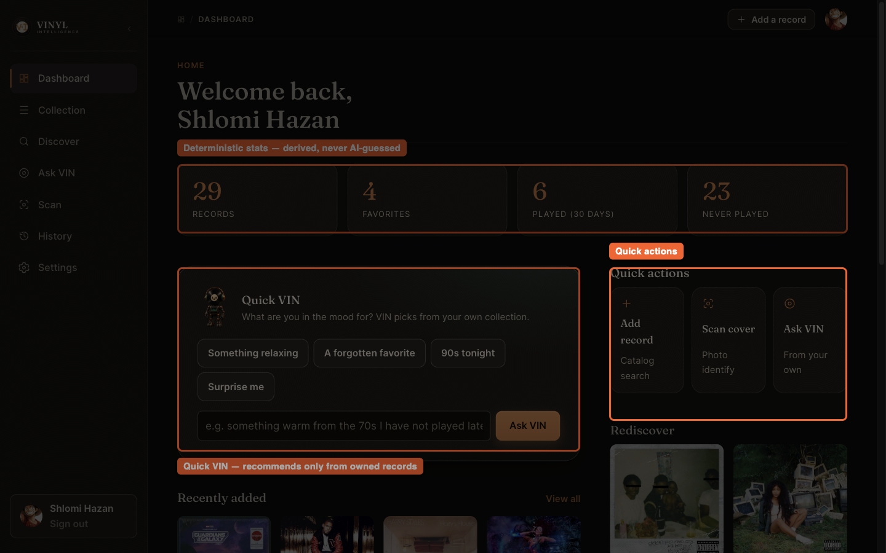
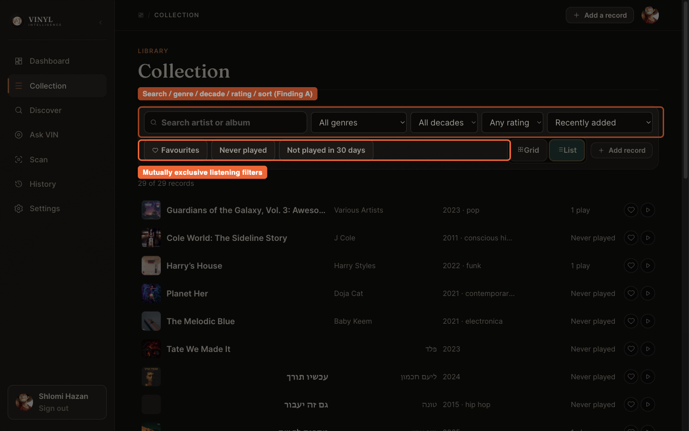
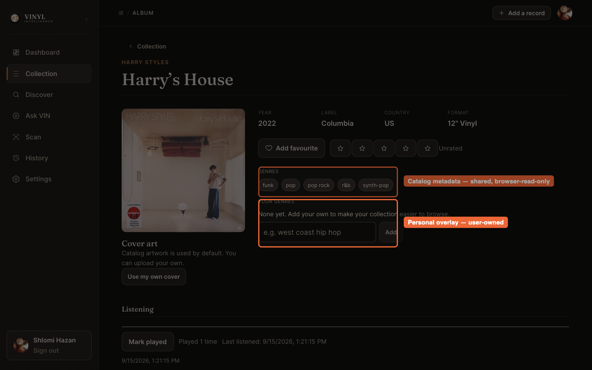
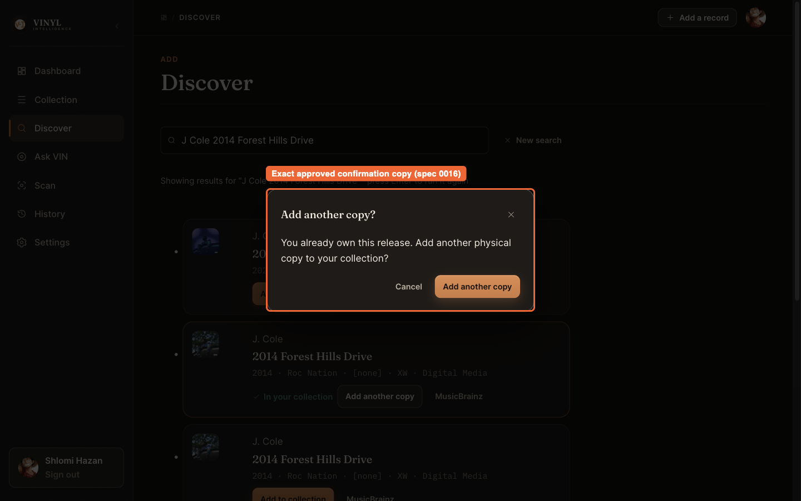
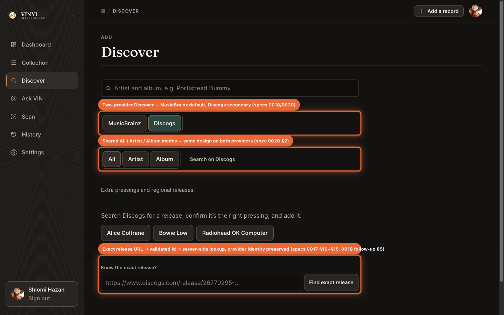
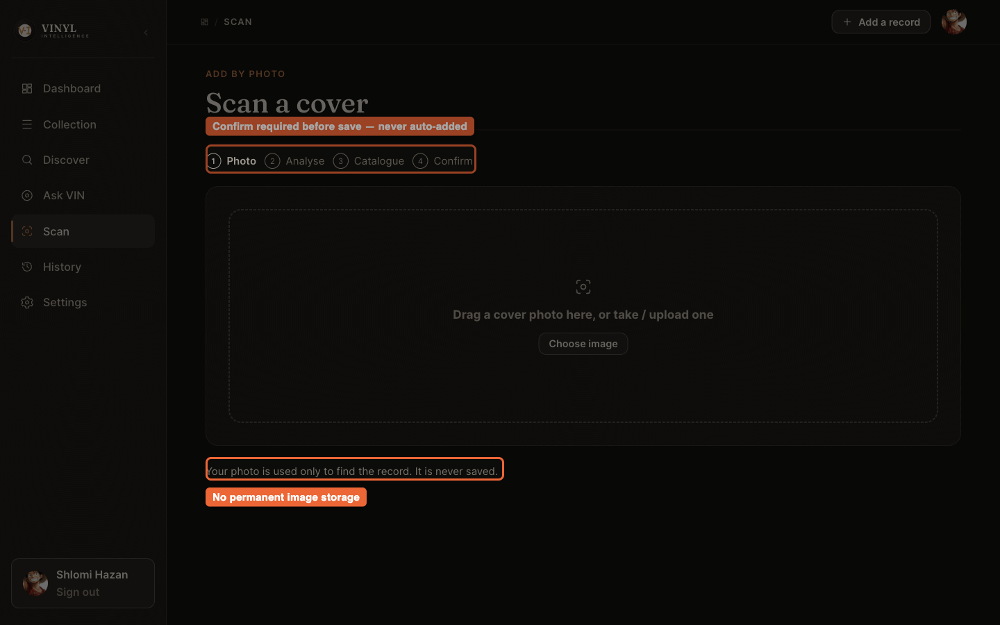
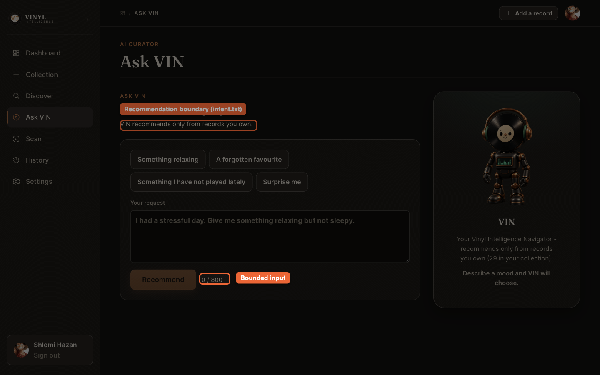
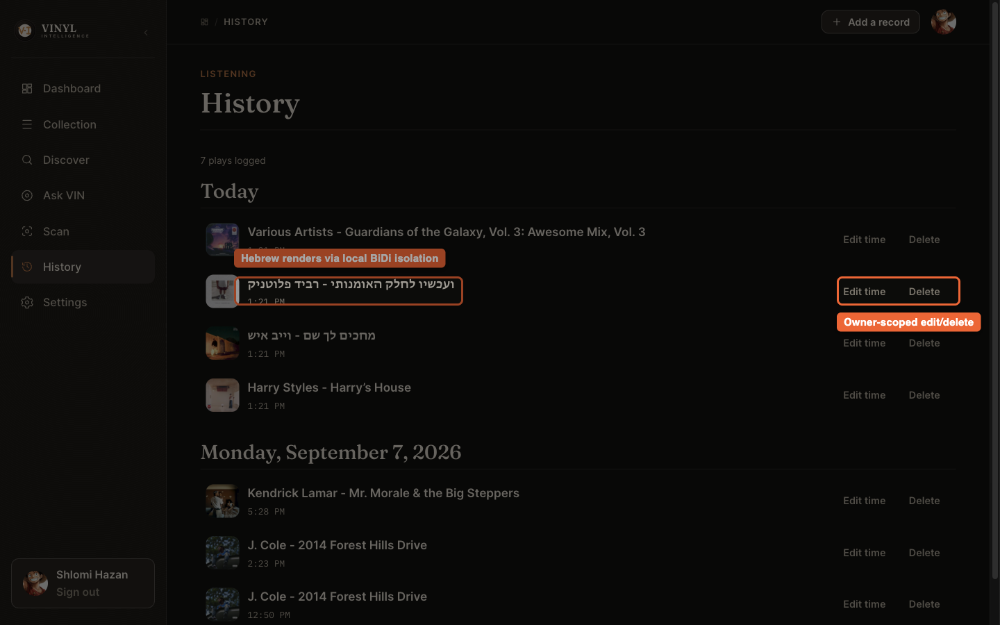
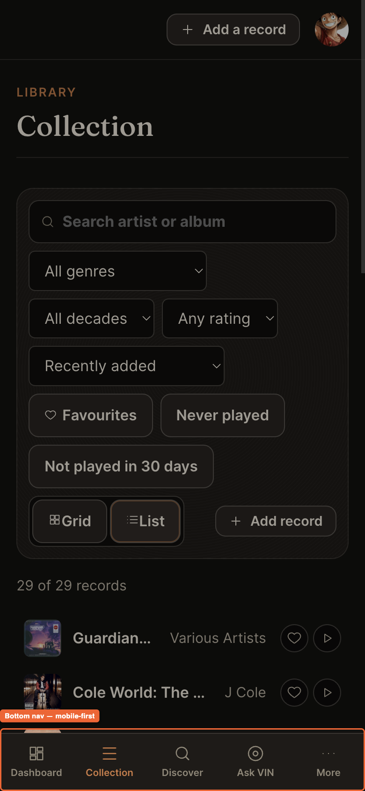

# 🔎 Vinyl Intelligence — Visual Inspect

*A fast reviewer walkthrough of the final product.*

If you have five to ten minutes to inspect this project, this is the path: nine stops, each pointing at the strongest evidence for one claim the project makes. For the full contract see [`../SPEC.md`](../SPEC.md); for step-by-step usage see [`USER_GUIDE.md`](USER_GUIDE.md); for the complete engineering evidence trail see [`verification.md`](verification.md).

Live application: **<https://vinyl-intelligence.netlify.app>**

## Table of Contents

1. [🏠 Dashboard — Deterministic Stats & AI Entry Points](#-1-dashboard--deterministic-stats--ai-entry-points)
2. [🎚️ Collection Controls — Finding A Evidence](#-2-collection-controls--finding-a-evidence)
3. [💿 Record Detail — The Metadata Boundary](#-3-record-detail--the-metadata-boundary)
4. [🔁 Duplicate-Copy Handling — Finding B Evidence](#-4-duplicate-copy-handling--finding-b-evidence)
5. [🔎 Discover — Two-Provider Search, Modes & Exact Lookup](#-5-discover--two-provider-search-modes--exact-lookup)
6. [📸 Scan — Vision Privacy & Confirm-Before-Save](#-6-scan--vision-privacy--confirm-before-save)
7. [🤖 VIN — The Recommendation Boundary](#-7-vin--the-recommendation-boundary)
8. [🎧 History — Hebrew Rendering & Owner-Scoped Correction](#-8-history--hebrew-rendering--owner-scoped-correction)
9. [📱 Mobile — Responsive, No Overflow](#-9-mobile--responsive-no-overflow)
10. [📚 Where to Go Deeper](#-10-where-to-go-deeper)

---

## 🏠 1. Dashboard — Deterministic Stats & AI Entry Points

**🔍 What to inspect:** the four stat cards (records, favorites, played in 30 days, never-played) are derived directly from the collection and listening tables — nothing here is AI-guessed. "Quick VIN" and "Quick actions" are the two on-ramps into AI-assisted flows (curator, vision recognition); both are optional, never required to use the app.

## 🎚️ 2. Collection Controls — Finding A Evidence

**🔍 What to inspect:** minimum-rating filter, rating sort (both directions, unrated always last), and two mutually-exclusive listening-recency filters ("Never played" / "Not played in 30 days") plus a "Least recently played" sort. This is the exact capability the Final Submission Alignment's Finding A restored — see [`specs/0016-final-submission-alignment.md`](specs/0016-final-submission-alignment.md) and the "Final Submission Alignment Evidence" section of [`verification.md`](verification.md) for the independent-review correction history and human-acceptance record.

## 💿 3. Record Detail — The Metadata Boundary

**🔍 What to inspect:** catalog genres are read-only chips (shared catalog data, sourced from MusicBrainz or Discogs depending on how the record was added); "Your genres" is a separate, editable, owner-scoped overlay. This is the concrete UI evidence for the deterministic/shared-vs-owned data boundary described in [`../SPEC.md`](../SPEC.md) §30/§32 and [ADR 0006](decisions/0006-listening-event-mutability-and-profile-avatar.md). A Discogs-backed record's equivalent provider-provenance layout is shown in Stop 5.

## 🔁 4. Duplicate-Copy Handling — Finding B Evidence

**🔍 What to inspect:** the exact approved confirmation copy, captured live against a real already-owned MusicBrainz release. This is Finding B's restored contract — an already-owned release is disclosed honestly, never blocked, and a second physical copy requires exactly one intentional confirmation. Cancel makes zero writes; Confirm creates exactly one row. Identical behavior exists in Scan. Full independent-review chronology (including the corrected post-add stale-ownership race) is in `verification.md`.

## 🔎 5. Discover — Two-Provider Search, Modes & Exact Lookup

**🔍 What to inspect (live, ~2 minutes):** one shared search box serves both catalog providers via the **MusicBrainz | Discogs** selector — **MusicBrainz stays selected by default** on every load, and neither switching provider nor switching mode ever fires a search by itself (the annotated callouts above mark exactly these three regions: the provider selector, the shared All/Artist/Album mode row — the same explicit, mutually-exclusive `role="radio"`/`aria-checked` group on both providers, not a toggle-button group, each paired with its own outbound **"Search on MusicBrainz"** / **"Search on Discogs"** link — and the exact-release-URL area). Click **Discogs**, then reproduce this exact case:

- Search query: `כהן מה שאפשר עם מה שנשאר` — real artwork, the required "Data provided by Discogs." attribution, and owned/addable state all render (see [`USER_GUIDE.md`](USER_GUIDE.md) §7 for the full walkthrough and [`assets/screenshots/19-discover-discogs-results.png`](assets/screenshots/19-discover-discogs-results.png)).
- Exact release: paste `https://www.discogs.com/release/26770295` into "Know the exact release?" — resolves to exactly one candidate ([`assets/screenshots/20-discover-discogs-exact-lookup.png`](assets/screenshots/20-discover-discogs-exact-lookup.png)).

This is the Discover & MusicBrainz Navigation Enhancement's original core contract, now extended to a second provider: the server never fetches a pasted URL itself for either provider — only a locally-extracted, pattern-validated release ID crosses the boundary, re-validated again server-side (`docs/specs/0017-discover-musicbrainz-navigation-enhancement.md` §10–§15; `docs/specs/0018-discogs-secondary-catalog-provider.md`; `docs/specs/0020-discogs-discover-parity-followup.md`). MusicBrainz and Discogs identity are never conflated — an "In your collection" / "Add another copy" disclosure (§4 above) is checked against the exact `(provider, provider_release_id)` pair. Full evidence in `verification.md`'s "Discover & MusicBrainz Navigation Enhancement Evidence" and "Discogs Discover Parity Follow-up" sections.

## 📸 6. Scan — Vision Privacy & Confirm-Before-Save

**🔍 What to inspect:** the four-step progress indicator (Photo → Analyse → Catalogue → **Confirm**) makes the "never auto-added" contract visible in the UI itself, and the privacy note under the drop zone states the photo is never saved. This screenshot is deliberately captured **before** any analysis is triggered — no Vision API call was made to produce this documentation.

## 🤖 7. VIN — The Recommendation Boundary

**🔍 What to inspect:** the explicit on-screen guarantee ("VIN recommends only from records you own") and the bounded input (800-character cap, live counter). The enforcement itself is server-side, not just a UI promise — see [`../SPEC.md`](../SPEC.md) §25 and the candidate-validation code referenced in `verification.md`'s AI/curator evidence. This screenshot is captured **before** any request is sent — no OpenRouter call was made to produce this documentation.

## 🎧 8. History — Hebrew Rendering & Owner-Scoped Correction

**🔍 What to inspect:** a real Hebrew-titled play logged alongside English ones, rendering correctly without breaking the row layout, next to the owner-scoped **Edit time** / **Delete** controls that ADR 0006 deliberately and minimally added on top of the originally-append-only listening log.

## 📱 9. Mobile — Responsive, No Overflow

**🔍 What to inspect:** the same Collection filters stack vertically with no horizontal overflow, and primary navigation collapses into a bottom tab bar — evidence for the Visual Experience & Product Identity pass's responsive requirement.

## 📚 10. Where to Go Deeper

| Question | Where to look |
| --- | --- |
| What exactly is the product contract? | [`../SPEC.md`](../SPEC.md) |
| How do I use every screen? | [`USER_GUIDE.md`](USER_GUIDE.md) |
| What's the system architecture? | [`architecture.md`](architecture.md) |
| What AI models are used, and how are they bounded? | [`ai-design.md`](ai-design.md) |
| What's the database schema and RLS posture? | [`data-model.md`](data-model.md), [`security.md`](security.md) |
| What was actually verified, and by whom? | [`verification.md`](verification.md) |
| How did the project evolve, milestone by milestone? | [`roadmaps/2026-09-02-complete-project-roadmap.md`](roadmaps/2026-09-02-complete-project-roadmap.md) |
| What did the *original* plan look like before implementation? | [`roadmaps/2026-08-18-complete-project-roadmap.md`](roadmaps/2026-08-18-complete-project-roadmap.md) (preserved unchanged) |
| Every milestone spec / ADR | [`specs/README.md`](specs/README.md) · [`decisions/README.md`](decisions/README.md) |

No screenshot in this guide or in [`USER_GUIDE.md`](USER_GUIDE.md) triggered a real Vision or curator model call — every AI-adjacent screen was captured in its safe, pre-call state, exactly as a cost-conscious reviewer would want.
