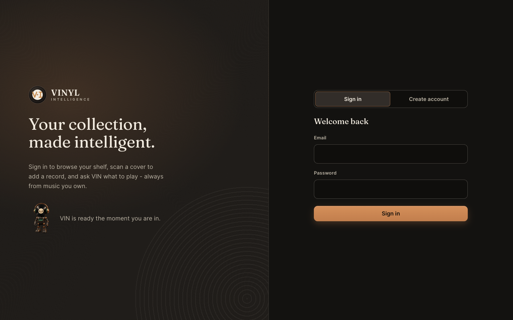
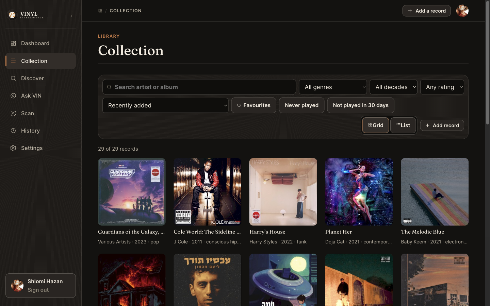
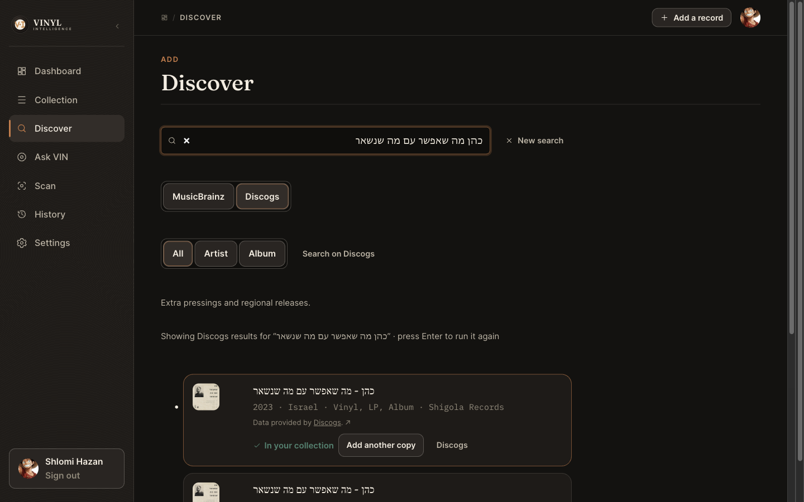
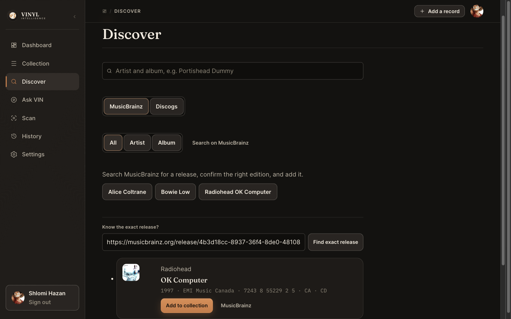
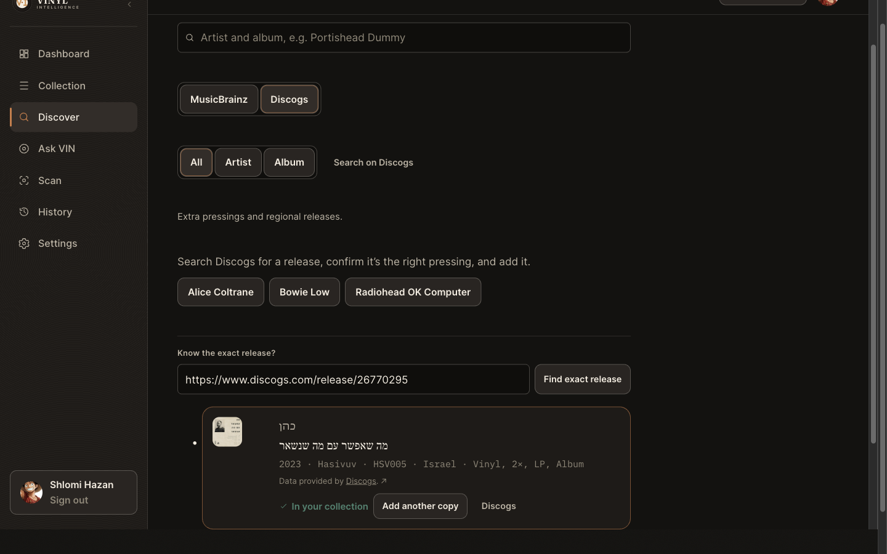
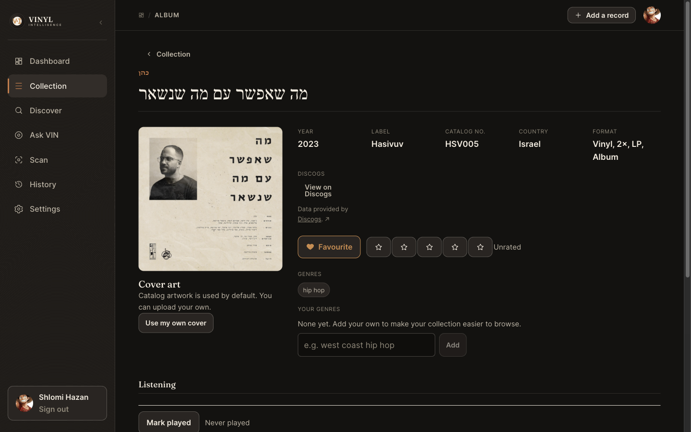
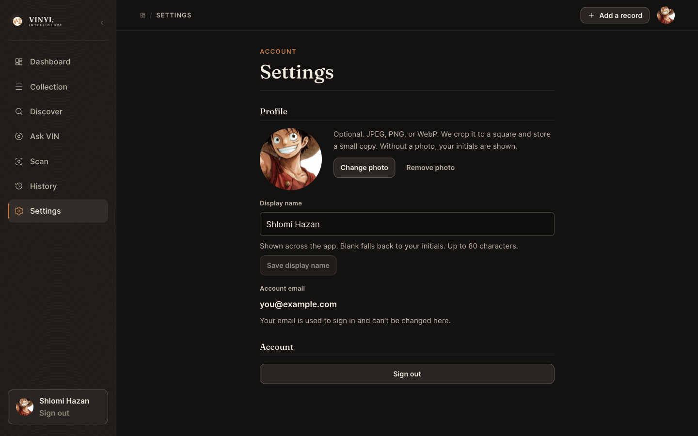

# 📖 Vinyl Intelligence — User Guide

A screen-by-screen guide to using the application. For the product's final contract see [`../SPEC.md`](../SPEC.md); for a fast reviewer walkthrough see [`INSPECT.md`](INSPECT.md); for the project overview see [`../README.md`](../README.md).

## Table of Contents

1. [👋 Introduction](#-1-introduction)
2. [⚡ Quick Start](#-2-quick-start)
3. [🔐 Landing & Authentication](#-3-landing--authentication)
4. [🏠 Dashboard](#-4-dashboard)
5. [📀 Collection — Browsing, Search, Filters, Sorting, Views](#-5-collection--browsing-search-filters-sorting-views)
6. [➕ Adding a Record Manually](#-6-adding-a-record-manually)
7. [🔎 Discovering Records — MusicBrainz & Discogs](#-7-discovering-records--musicbrainz--discogs)
8. [🔁 Duplicate-Copy Confirmation](#-8-duplicate-copy-confirmation)
9. [📸 Scanning a Record Cover](#-9-scanning-a-record-cover)
10. [💿 Record Detail & Personal Metadata](#-10-record-detail--personal-metadata)
11. [🎧 Listening History](#-11-listening-history)
12. [🤖 VIN — AI Curator](#-12-vin--ai-curator)
13. [👤 Profile / Settings / Avatar](#-13-profile--settings--avatar)
14. [🌍 Hebrew & Multilingual Records](#-14-hebrew--multilingual-records)
15. [⚠️ Error, Empty & Loading States](#-15-error-empty--loading-states)
16. [🔒 Privacy & Data Ownership](#-16-privacy--data-ownership)
17. [❓ FAQ](#-17-faq)

---

## 👋 1. Introduction

Vinyl Intelligence has two ways to use your collection: browse it directly (Collection, search, filters), or describe what you're in the mood for and let VIN pick from what you actually own. Nothing described here requires developer knowledge — this guide assumes only that you have an account and, ideally, at least one record in your collection.

## ⚡ 2. Quick Start

1. Open **<https://vinyl-intelligence.netlify.app>**.
2. Create an account or sign in.
3. Add your first record — manually, via **Discover** (catalog search), or via **Scan** (photograph the cover).
4. Browse **Collection** to see it organized automatically.
5. Ask **VIN** what to play.

## 🔐 3. Landing & Authentication

The landing page explains the product to a signed-out visitor and links to sign-in. Choosing **Sign in** opens a split-layout auth screen with **Sign in** / **Create account** tabs:

| Control | What it does | When to use it |
| --- | --- | --- |
| Sign in / Create account tabs | Switches the form mode | Creating an account the first time |
| Email / Password fields | Your login credentials | Every sign-in |
| Sign in / Create account button | Submits the form | After filling both fields |

New accounts require email confirmation before first sign-in.

## 🏠 4. Dashboard

The Dashboard is the home screen after sign-in.

| Area | What it shows | Notes |
| --- | --- | --- |
| Stat cards | Records, Favorites, Played (30 days), Never played | Always derived live from your data, never estimated |
| Quick VIN | Mood presets + a free-text request box | Takes you straight into a curator request without opening the full VIN page first |
| Quick actions | Add record, Scan cover, Ask VIN | One click to the three ways of growing/using the collection |
| Recently added | Your newest records | "View all" opens Collection sorted the same way |
| Rediscover | Owned records you rarely play | Surfaces "forgotten" records deterministically from listening history |

## 📀 5. Collection — Browsing, Search, Filters, Sorting, Views

| Control | What it does | When to use it |
| --- | --- | --- |
| Search artist or album | Text search across artist/title | Finding a specific record fast |
| All genres | Filters to one catalog genre | Narrowing by style |
| All decades | Filters to a derived decade (1960s…2020s) | Browsing a musical era |
| Any rating | Minimum-rating filter: Any / 3★+ / 4★+ / 5★+ | Surfacing only your best-rated records |
| Sort dropdown | Recently added, alphabetical (artist/album), year (newest/oldest), rating (highest/lowest), least recently played | Reordering the whole list |
| Favourites chip | Shows only favorited records | Quick access to your favorites |
| Never played chip | Shows only records with zero logged plays | Finding records you haven't gotten to yet |
| Not played in 30 days chip | Shows records that are stale (never played, or not played in the last 30 days) | "What have I been ignoring lately?" — mutually exclusive with Never played |
| Grid / List toggle | Switches the layout | Grid for browsing covers, List for scanning many rows with play counts |
| Add record / Add a record | Opens the manual-add form | When catalog/photo lookup won't apply |

Applying any filter updates the "N of M records" count immediately and adds a **Clear filters** link. Every control writes to the page URL, so a filtered/sorted view can be refreshed or bookmarked and it comes back exactly as you left it. Nothing here ever makes a network request on a filter change — it's instant.

List view adds a per-row play count ("Never played" / "N play(s)") plus quick favorite/play-log icon buttons.

## ➕ 6. Adding a Record Manually

From Collection, click **Add record** (or **Add a record** in the top bar). Fill in the fields you know — artist and title are required, everything else is optional — and save. Use this when a record genuinely has no match on either catalog provider (a bootleg, an extremely obscure pressing, a private release) — try Discover's MusicBrainz **and** Discogs search first (§7).

## 🔎 7. Discovering Records — MusicBrainz & Discogs

Discover has **one search box shared by two catalog providers** — a **MusicBrainz | Discogs** selector sits right below it. **MusicBrainz is selected by default** every time you open the page. Switching providers (or switching modes, below) is instant and **never runs a search by itself** — it only changes what a search *would* do the next time you press Enter or click a search button — and whatever you've already typed stays in the box across the switch, so you never have to retype it.

Type an artist and album (the example chips — "Alice Coltrane," "Bowie Low," "Radiohead OK Computer" — show the expected format and work under either provider) and press Enter or the search icon. Both providers show the same three modes above the results, mutually exclusive and single-select:

| Mode | Searches | When to use it |
| --- | --- | --- |
| **All** (default) | artist name *or* release title | you're not sure which one you typed |
| **Artist** | artist name only | a common word in the artist name is drowning in unrelated release-title matches |
| **Album** | release title only | you know the exact title and want to skip artist noise |

Switching modes clears the current results (they were fetched under the old mode's meaning) but keeps whatever you've typed — no retyping needed, and no search runs until you press Enter again.

### MusicBrainz results

Each MusicBrainz result shows the release's year, label, catalog number, country, and format, plus a link to view it on MusicBrainz. Click **Add to collection** on the correct edition to import it. Results come five at a time; if more exist, a **Load more** button appends the next five (up to 20 total per search) without losing what's already on screen. If a later page fails to load, the ones already showing stay put and a **Retry** re-fetches just that page.

### Discogs results

Select **Discogs** to search a second, independent catalog — useful for regional pressings and releases MusicBrainz doesn't carry. A Discogs result shows cover artwork when Discogs has it available and the fetch is fresh (not guaranteed for every release — only the image's URL is ever kept, never the image itself, and it's never proxied through the server), the release's year, country, format, label, and catalog number, and the required **"Data provided by Discogs."** attribution linking back to the release's Discogs page. Discogs results have no "Load more" paging (they're a bounded, single fetch), and — this is deliberate — **Discogs and MusicBrainz results are never combined, matched, or deduplicated against each other**: adding the same release through both providers creates two separate, honestly-labeled collection entries.

Still not finding it? Two escape hatches, in order, for whichever provider you have selected:

- **Search on MusicBrainz** / **Search on Discogs** — opens that provider's own full search site in a new tab, carrying over whatever you've typed, for when Vinyl Intelligence's bounded result window isn't enough.
- **Know the exact release?** — if you've found the release yourself on MusicBrainz or Discogs, paste its release URL and click **Find exact release**:
  - MusicBrainz: `https://musicbrainz.org/release/...`
  - Discogs: `https://www.discogs.com/release/...`

  Vinyl Intelligence extracts and validates the release ID from the URL itself — you never have to copy just the ID — and looks up that exact release. The pasted URL is validated in your browser before anything is sent, and only the extracted ID ever reaches the server; an invalid link (wrong site, wrong page type, malformed ID) is rejected locally with no network request at all. Each provider's exact-lookup field only accepts that provider's own URL shape.

An exact-URL result appears in the same candidate card as any other result for that provider, with the same **Add to collection** action and the same duplicate-copy handling below — pasting a URL never adds anything by itself.

A brand-new (not-yet-owned) result from either provider adds directly with one click on **Add to collection** — no extra confirmation step in the way. If none of that matches, use **Can't find it? Add it manually** at the bottom of the page (§6) — the manual-entry fallback is identical regardless of which provider you were searching.

## 🔁 8. Duplicate-Copy Confirmation

If a search result — MusicBrainz or Discogs — is a release you already own (matched by its exact provider identity: provider + release ID, never guessed, and MusicBrainz/Discogs identities are never conflated with each other), Discover tells you honestly instead of blocking or silently duplicating it:

| State | What you see | What happens |
| --- | --- | --- |
| Not owned | Ordinary **Add to collection** button | One click adds it — no dialog |
| Already owned | **✓ In your collection** + **Add another copy** | Clicking "Add another copy" opens the confirmation dialog above |
| Dialog → Cancel | Dialog closes | Nothing is added; your collection count is unchanged |
| Dialog → Add another copy (confirm) | Dialog closes | Exactly one additional physical copy is added |

This exact same behavior exists in **Scan** for a candidate recognized from a photo (§9).

## 📸 9. Scanning a Record Cover

1. **Photo** — drag a cover photo onto the drop zone, or choose/take one.
2. **Analyse** — click **Analyse cover**; a vision model reads the sleeve for clues (artist, title, label, catalog number, approximate year).
3. **Catalogue** — those clues run a MusicBrainz search automatically, no extra input needed.
4. **Confirm** — pick the matching release from the candidates, exactly like Discover, including the same duplicate-copy handling from §8. Nothing is saved before this step.

If the photo is unclear, you'll be offered "Search by text instead" (hands the clues to Discover) or "Add manually." **Your photo is used only to find the record — it is never saved.**

## 💿 10. Record Detail & Personal Metadata

| Section | Editable? | Notes |
| --- | --- | --- |
| Artist / title / year / label / country / format | No | Shared catalog facts sourced from MusicBrainz or Discogs, depending on how the record was added (or your own entry, for a manual record) |
| ♡ Add favourite | Yes | Toggles the favorite flag |
| ★ rating row | Yes | Click a star to rate 1–5; click the filled star again to return to unrated |
| Genres | No | Catalog-sourced tags |
| Your genres | Yes | Type a tag and click **Add**; these are yours alone and combine with catalog genres for filtering |
| Cover art | Yes | **Use my own cover** uploads a replacement; catalog artwork (MusicBrainz's Cover Art Archive image, or a persisted Discogs image) is the default |
| MusicBrainz / Discogs | No | A catalog-backed release shows a provenance entry for its source provider — **MusicBrainz** / **View on MusicBrainz**, linking to its exact release page on musicbrainz.org, or **Discogs** / **View on Discogs**, linking to its exact release page on discogs.com, paired with the required **"Data provided by Discogs."** attribution directly beneath the link; a manually-created record shows neither, since it has no catalog identity to point to |
| Listening | Yes (log only) | **Mark played** logs a play now; see §11 for corrections |

The two providers' record-detail layouts match — same field positions, same styling — with the Discogs one additionally carrying the attribution line above.

Personal notes (not shown in the screenshots above) are available on the same page for a private, free-text note per record — never shared, never sent to any AI model.

## 🎧 11. Listening History

Every logged play appears here, grouped by day, newest first. **Edit time** lets you correct a mistyped listening time on your own entry; **Delete** removes your own accidental log entry. Neither action can move a play to a different record or affect anyone else's history — that boundary is enforced by the database itself, not just the interface.

## 🤖 12. VIN — AI Curator

1. Pick a preset (**Something relaxing**, **A forgotten favorite**, **Something I have not played lately**, **Surprise me**) or type your own request (up to 800 characters).
2. Click **Recommend**.
3. VIN returns up to three picks, each with a short reason grounded in your real collection and listening history.
4. Type a short follow-up (e.g. "make it more energetic") to refine the same request — up to three refinement turns per session.

**VIN never recommends anything you don't own.** If a request is unrelated to choosing what to play, VIN says so instead of guessing.

Your VIN conversation lives only in your browser's memory for the current session — refreshing, signing out, or starting over clears it. Nothing is stored server-side.

## 👤 13. Profile / Settings / Avatar

| Control | What it does |
| --- | --- |
| Change photo / Remove photo | Sets or clears your profile avatar (cropped square, private storage; initials shown without one) |
| Display name | Shown across the app; save with **Save display name** |
| Account email | Read-only here — it's your sign-in identifier and can't be changed from this screen |
| Sign out | Ends your session |

## 🌍 14. Hebrew & Multilingual Records

A record with a Hebrew (or any non-Latin-script) title and artist renders correctly and reads right-to-left where appropriate, while the surrounding app chrome (menu, labels, buttons) stays in English. Search and sorting understand Hebrew text (including ignoring niqqud/vowel points), and cover recognition preserves whatever script is actually printed on the sleeve rather than translating it.

## ⚠️ 15. Error, Empty & Loading States

- An empty Collection shows a clear call to action rather than a blank page.
- A search with no results is shown distinctly from a search that failed — "no matches, try different words" is not the same message as "the catalog is unreachable, try again."
- A failed AI call (recognition or VIN) is shown as a failure with a retry path — never as a silently empty result or a made-up answer.
- Every add/write action that's in progress disables its own trigger button so a second click can't double-submit.

## 🔒 16. Privacy & Data Ownership

- Your collection, ratings, notes, personal genres, and listening history are yours — Row-Level Security means no other user can read or write them, and there is no admin UI that bypasses that.
- A photo you upload to **Scan** is used only to identify a record — it is transient and is not permanently stored. A **custom cover** you choose for a record, by contrast, is artwork you're intentionally keeping, and is stored in your own private Storage space until you replace or remove it.
- Your VIN conversation is never saved anywhere.
- Shared catalog facts (the parts sourced from MusicBrainz or Discogs, whichever provider a record was added through) are shared read-only reference data used by everyone's collection — editing them isn't offered because they aren't yours alone to change; your own corrections live in the personal-metadata overlays described in §10.

## ❓ 17. FAQ

**Does adding a second pressing of a record I own overwrite the first?**
No. See §8 — it always requires an explicit confirmation and always creates a separate item; deleting one never touches the other.

**Will VIN ever suggest something I don't own?**
No — this is enforced on the backend, not just in the interface (see [`../SPEC.md`](../SPEC.md) §25/§30).

**Is my photo of a record cover kept anywhere?**
No — it's used once, to extract search clues, and then discarded.

**Can I use the app in Hebrew throughout?**
The app's own interface stays in English by design; only your record data (titles, artists, notes, genres) is multilingual-aware. See §14.

**Can I add the same record from both MusicBrainz and Discogs?**
Yes. The two providers are never cross-matched, so Vinyl Intelligence has no way to know whether a MusicBrainz release and a Discogs release are the same pressing or different ones — adding from both simply creates two separate, honestly-labeled collection entries, without claiming either way.

**What happens if MusicBrainz, Discogs, or the AI provider is down?**
You'll see an honest error with a retry option, never a fabricated result. MusicBrainz and Discogs fail independently — one being unavailable never blocks searching the other.
